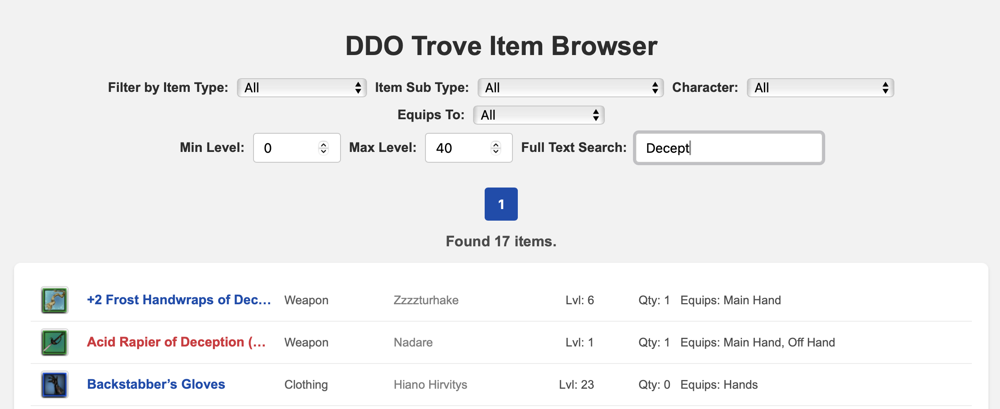
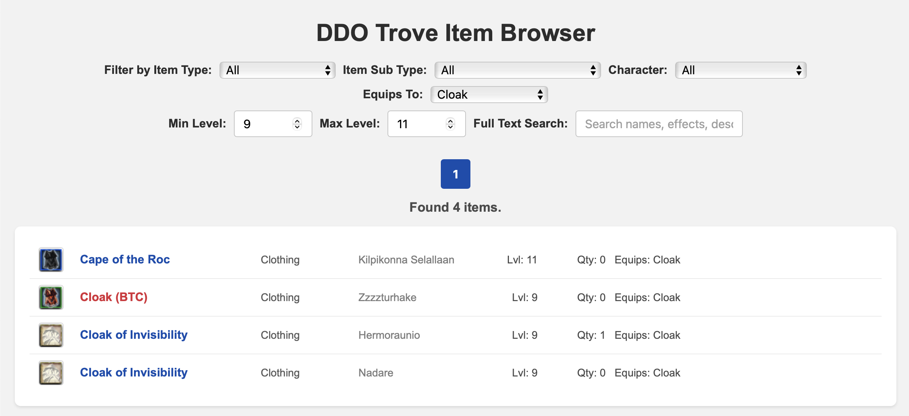
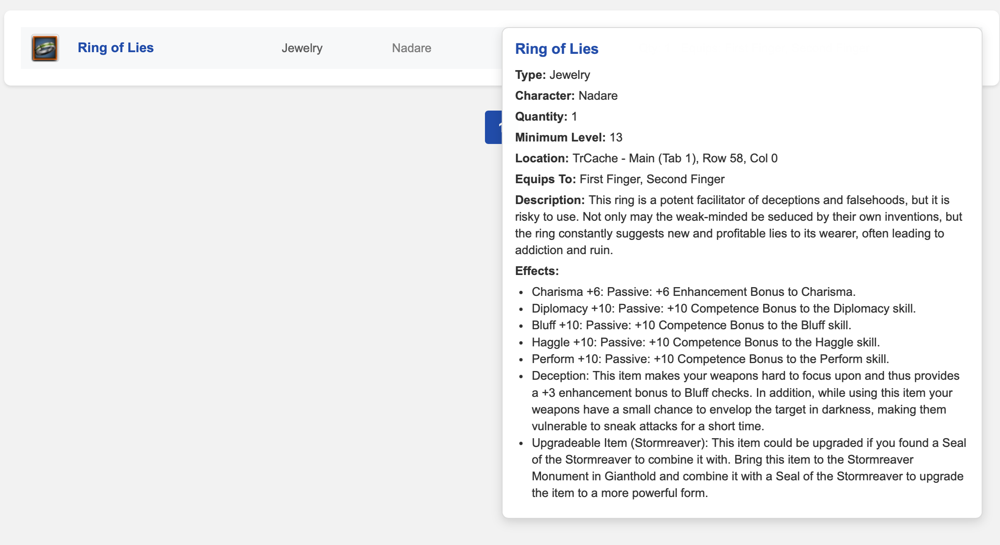

# DDO Trove UI

Disclaimer: This is vibe coded tool for my personal amusement. If you get it to work, more power to you.

This is a simple web UI for browsing DDO (Dungeons and Dragons Online) item data.

## Features

*   **Item Browsing**: View a list of all items loaded from your DDO data files.
*   **Filtering**:
    *   Filter by Item Type (e.g., "Weapon", "Armor", "Accessory").
    *   Filter by Item Sub Type (e.g., "Longsword", "Heavy Armor", "Ring").
    *   Filter by Character Name (e.g., "MyMainChar", "Account (Shared Bank)").
    *   **Full Text Search**: Search across item names, descriptions, effects, and clicky spells. Items with name matches are listed first, followed by items with matches in other fields.
    *   Filter by Minimum Level range.
    *   Filter by Equips To: Filter items by where they can be equipped (e.g., "Hands", "Body", "Finger").
*   **Pagination**: Browse through large item lists page by page.
*   **Item Details on Hover**: Hover over an item in the list to see its full details (description, clicky, augment slots, effects, etc.).
*   **Multiple Input Directories**: The application now uses default input directories (`example/local`, `example/server2`). You can modify these defaults in `main.go` if needed.

## Screenshots







## Usage

### Prerequisites

*   Go (1.23 or higher)
*   Your DDO item data in JSON format (from a tool like [Dungeon Helper](https://dungeonhelper.com) Trove plugin).

### Running the Application

1.  **Clone the repository:**
    ```bash
    git clone https://github.com/fingon/ddo-trove-ui.git
    cd ddo-trove-ui
    ```

2.  **Place your JSON data:**
    Place your DDO item JSON files into the default directories `example/local` and `example/server2`. You can create these directories if they don't exist. (Or point it at where Trove plugin stores them, e.g. `..AppData/Roaming/Dungeon Helper/plugins/Trove/<server>/<account-id>` and then start the server with those paths).

3.  **Run the application:**
    ```bash
    go run main.go example/local example/local2
    ```
    The application will automatically load items from the `example/local` and `example/local2` directories.

4.  **Access the UI:**
    Open your web browser and navigate to `http://localhost:8080`.

## Development

This project uses [Templ](https://templ.guide/) for HTML templating. To regenerate Go code from `.templ` files after making changes: Run `make build`.

This project uses [prek](https://prek.j178.dev/) for code quality checks. To install hooks:
```bash
prek install
```

To run all checks:
```bash
prek run --all-files
```
